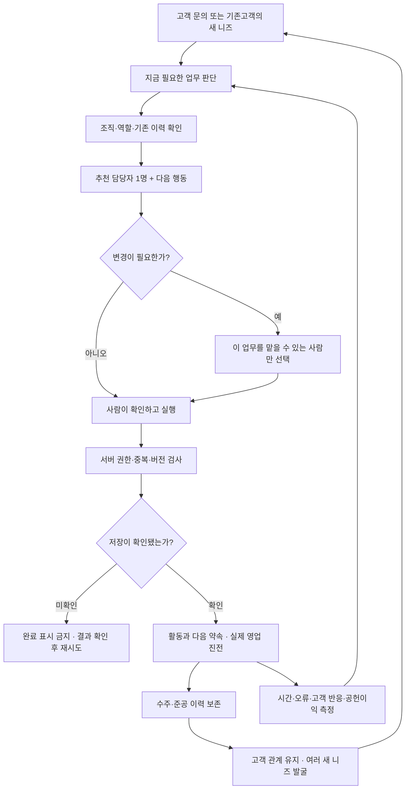
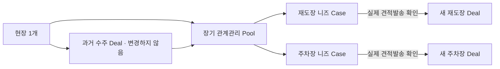

# 다음 행동이 보이는 CRM

**다 보여주지 말고, 지금 이어갈 사람과 다음 행동만.**

- 로컬 개선: 담당자 한 명 + 변경, 저장응답 확인, 다음 행동 담당 재검사.
- 배포 전 차단사항: 서버 권한, 계정 간 대기열 격리, 기존 서버의 성공응답 계약.
- 예상 밖의 제약: 기존 수주 1건에서 생기는 여러 추가공사 니즈를 각각 관리해야 한다.
- 성공 기준: 처리시간 감소 + 실제 고객 진전 + 서버 일관성 + 추가 공헌이익. 발송량이 아니다.

## 최종 운영 흐름

아래는 목표 설계다. 녹색의 서버 저장·권한 검증까지 운영에서 확인한 상태를 뜻하지 않는다.

## 한 고객 안의 구조

현재는 원 수주 Deal별 Pool과 단일 전환 연결이므로 위 다중 Case 구조는 제안이며 미적용이다.

전체 의사결정 격자, 근거, 보안 위험, 비용 가정, API/데이터 설계, 시험과 성장 계획은 [JSON 보고서](crm-audit-20260905.json)에 있다.
